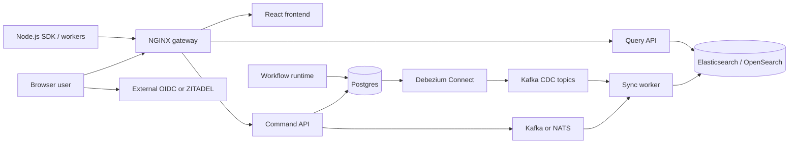

# ArtificialFlow

ArtificialFlow is an open-source BPMN workflow platform for modeling, running, and
observing business processes. It combines a Go workflow engine, React modeler
and operations UI, CQRS query projection, OIDC-based identity, and a Node.js
SDK.

Use Docker Compose to evaluate the complete solution from published Docker Hub
images. Use the Helm chart for production Kubernetes deployments.

## What ArtificialFlow provides

- Browser BPMN modeler, process catalog, dashboards, and instance history
- Command API for workflow deployment, instance mutation, messages, and signals
- Runtime service for workflow execution, timers, jobs, and SLA processing
- External-worker APIs with locking, retries, idempotency, and capabilities
- Read-optimized query API backed by Elasticsearch or OpenSearch
- Kafka/NATS event transport and Kafka/Debezium CDC projection
- External OIDC or bundled ZITADEL identity deployment
- Node.js SDK for workflows, workers, inbox applications, and administration

See the [BPMN support matrix](docs/BPMN_SUPPORT_MATRIX.md) for the current
engine contract.

## Architecture



Main components:

- **Gateway**: single entry point; routes `/` to the frontend, `/api/` to the
  command service, and `/api/query/` to the query service.
- **Frontend**: BPMN modeler, dashboards, process/instance views, human task
  views, identity administration, and SDK-client management.
- **Command service**: workflow writes, worker APIs, identity endpoints,
  idempotency, and transactional outbox.
- **Runtime**: advances workflow execution and handles timers and background
  work.
- **Sync worker**: consumes application events and/or Debezium CDC records and
  updates search projections.
- **Query service**: serves read-optimized process and instance data from
  Elasticsearch or OpenSearch.
- **IAM**: validates browser and machine identities through external OIDC or
  bundled ZITADEL.

The command database is the source of truth. Search-backed query views are
eventually consistent. Read the detailed [architecture guide](docs/architecture.md)
and [CQRS runbook](docs/RUNBOOK_CQRS_SYNC.md).

## Quickstart (bundled / internal IAM)

Fastest path to a running ArtificialFlow stack: **bundled ZITADEL** (internal IAM).
ArtificialFlow bootstraps the ZITADEL project, frontend and API clients, standard
roles, and the local administrator. Use this for local evaluation; for an
existing corporate IdP see [Option 2: external IAM](#option-2-external-iam).

### Compose files

| File | Role |
| :--- | :--- |
| [`docker-compose.zitadel.yml`](docker-compose.zitadel.yml) | Full stack with bundled ZITADEL (Postgres, Kafka, Elasticsearch, Debezium, gateway, app services) |
| [`docker-compose.release.yml`](docker-compose.release.yml) | Override: pull published `artificialflow/*` images instead of building from source |
| [`docker-compose.external-iam.yml`](docker-compose.external-iam.yml) | Alternate stack when you bring your own OIDC provider (not this quickstart) |
| [`docker-compose.yml`](docker-compose.yml) | Base Compose fragment used by validation / legacy wiring checks |

IAM details for this mode: [Bundled ZITADEL](docs/iam.md#bundled-zitadel).
Longer walkthrough: [Getting started](docs/getting-started.md).

### Start from source (build locally)

```bash
git clone https://github.com/artificialflow/artificialflow.git
cd artificialflow
make up-zitadel
```

Equivalent Compose invocation:

```bash
docker compose -f docker-compose.zitadel.yml up -d --build
```

### Start from published images

```bash
git clone --depth 1 --branch v1.1.0 https://github.com/artificialflow/artificialflow.git
cd artificialflow
export ARTIFICIALFLOW_IMAGE_TAG=v1.1.0
make up-zitadel-release
```

Equivalent Compose invocation:

```bash
docker compose \
  -f docker-compose.zitadel.yml \
  -f docker-compose.release.yml \
  up -d
```

### Open and sign in

| Surface | URL |
| :--- | :--- |
| ArtificialFlow UI / gateway | <http://localhost:9100> |
| Command API | <http://localhost:9100/api> |
| Query API | <http://localhost:9100/api/query> |
| Bundled ZITADEL | <http://localhost:9180> |

Local administrator (development only):

- Username: `admin`
- Password: `admin`
- Email: `admin@admin.localhost`

### Verify

```bash
curl -fsS http://localhost:9100/api/health
curl -fsS http://localhost:9100/api/query/health
```

Next steps:

- Create a machine client under **SDK Clients**, then call the [HTTP API](docs/API.md)
  or the [Node.js SDK](docs/sdk-nodejs.md).
- Stop: `make down-zitadel` · wipe volumes: `make clean-zitadel`.

## Run the released solution from Docker Hub

The release Compose override removes local image builds and uses the published
`artificialflow/*` images:

- `artificialflow/workflow-command`
- `artificialflow/workflow-runtime`
- `artificialflow/workflow-query`
- `artificialflow/sync-worker`
- `artificialflow/frontend`

For one transition release, the matching `azizaltaleb/*` references point to
the exact same manifest digests. New deployments should use the canonical
namespace.

The commands below pin release `v1.1.0`. Review available tags and image
verification guidance in [Docker images](docs/DOCKER_IMAGES.md).

### Prerequisites

- Docker Engine or Docker Desktop
- Docker Compose v2
- `curl` for post-deployment checks
- Free local ports `5432`, `8080`, `8081`, `8083`, `8092`, `9092`, `9100`, and
  `9200`; bundled ZITADEL also uses `9180`

Obtain the matching deployment files:

```bash
git clone --depth 1 --branch v1.1.0 https://github.com/artificialflow/artificialflow.git
cd artificialflow
export ARTIFICIALFLOW_IMAGE_TAG=v1.1.0
```

This checkout supplies the Compose and configuration files. The release
commands pull application images from Docker Hub and do not build the source.

### Option 1: bundled ZITADEL

Choose this option for a self-contained evaluation environment. ArtificialFlow
automatically creates the ZITADEL project, frontend client, API introspection
client, standard roles, and initial administrator.

```bash
docker compose \
  -f docker-compose.zitadel.yml \
  -f docker-compose.release.yml \
  pull

docker compose \
  -f docker-compose.zitadel.yml \
  -f docker-compose.release.yml \
  up -d
```

Equivalent shortcut:

```bash
ARTIFICIALFLOW_IMAGE_TAG=v1.1.0 make up-zitadel-release
```

Open:

- ArtificialFlow: <http://localhost:9100>
- ZITADEL: <http://localhost:9180>

Local administrator:

- Username: `admin`
- Password: `admin`
- Email: `admin@admin.localhost`

These credentials, the HTTP issuer, and exposed infrastructure ports are for
development/evaluation only. The current bundled bootstrap also retains only
the configured initial human administrator during reconciliation. Review the
[bundled-IAM constraints](docs/deployment.md#helm-with-bundled-zitadel) before
using this deployment model outside evaluation.

### Option 2: external IAM

Choose this option when your organization already has an OIDC provider.
Before starting ArtificialFlow, the IAM administrator must create:

- Backend API audience/client `workflow-backend`
- Public Authorization Code + PKCE client `workflow-frontend`
- Machine-to-machine client for SDK and worker integrations
- `artificialflow admin`, `artificialflow modeler`, and `artificialflow client` roles
- Token mappings that include the ArtificialFlow audience and assigned roles

For local browser login, register `http://localhost:9100` as the redirect,
post-logout redirect, and allowed web origin.

Replace the `https://login.example.com` placeholders and client/claim settings
in `docker-compose.external-iam.yml`. Apply the same backend authentication
settings to both `app` and `workflow-query`. See
[external IAM prerequisites](docs/deployment.md#external-iam-prerequisites)
for JWT, opaque-token introspection, audience, claims, and network details.

Then pull and start the released images:

```bash
docker compose \
  -f docker-compose.external-iam.yml \
  -f docker-compose.release.yml \
  pull

docker compose \
  -f docker-compose.external-iam.yml \
  -f docker-compose.release.yml \
  up -d
```

Equivalent shortcut:

```bash
ARTIFICIALFLOW_IMAGE_TAG=v1.1.0 make up-external-iam-release
```

ArtificialFlow validates and authorizes external identities but does not create or
manage users, roles, clients, or tokens in the external provider.

### Verify the deployment

```bash
curl -fsS http://localhost:9100/api/health
curl -fsS http://localhost:9100/api/query/health
curl -fsS http://localhost:8092/health
curl -fsS http://localhost:8083/connectors/artificialflow-postgres-connector/status
```

The connector name is a legacy wire identifier retained for rolling-upgrade
compatibility; new product-facing names use ArtificialFlow.

The command/query endpoints must report `ok`, and the Debezium connector and
tasks must be `RUNNING`. HTTP health is process-level only; complete validation
also requires:

1. Successful browser login
2. An authenticated `/api/identity/me` response with the expected role
3. A workflow deployment and start
4. The resulting instance appearing through `/api/query/`

Useful operations:

```bash
# Status and logs for bundled IAM
make ps-zitadel
make logs-zitadel

# Status and logs for external IAM
make ps-external-iam
make logs-external-iam
```

Stop the selected stack with `make down-zitadel` or
`make down-external-iam`. The corresponding `make clean-*` command also deletes
all local volumes and data.

Fresh Compose deployments use project name `artificialflow` and explicit
canonical volume names. Follow the [deployment identity guidance](docs/deployment.md#deployment-identity-and-rename-compatibility).

## Production deployment

Docker Compose is not production hardened: it exposes infrastructure ports,
uses development credentials, and runs single-node stateful dependencies.

For production, use the [ArtificialFlow Helm chart](charts/artificialflow) and follow the
[production deployment guide](docs/deployment.md#kubernetes-and-helm). It
covers:

- External and bundled IAM values
- Kubernetes Secrets and TLS ingress
- Managed Postgres, Kafka/NATS, Debezium Connect, and search
- Connector credentials and logical-replication requirements
- Readiness and functional postconditions
- Backups, observability, network policy, resource sizing, and rollback

Pin release images or digests and review their SBOM, provenance, scan, and
signature information before rollout.

## IAM and authorization

ArtificialFlow recognizes these standard roles:

- `artificialflow admin`: human platform administrator
- `artificialflow modeler`: human process designer
- `artificialflow client`: SDK, worker, API, and automation identity

External IAM administrators must create and map these roles. Bundled ZITADEL
creates them automatically. Keep machine identities limited to
`artificialflow client`; do not grant SDK clients administrative roles.

Audience enforcement is enabled in the supplied external deployment. Tokens
must contain the configured backend audience, normally `workflow-backend`.

See [IAM and roles](docs/iam.md) for provider setup, claim paths, JWT versus
introspection, troubleshooting, and credential hardening.

## Node.js SDK

Install the SDK:

```bash
npm install @artificialflow/nodejs-sdk
```

Both IAM modes send the resulting access token to ArtificialFlow as a Bearer token.
Token acquisition differs:

- **Bundled ZITADEL**: download a private-key profile from **SDK Clients** and
  use `auth.type="zitadel-jwt-profile"`.
- **External IAM**: use `auth.type="oauth-client-credentials"` or provide a
  provider-managed token callback.

Every SDK identity needs `artificialflow client`. Keep private profiles, client secrets,
and access tokens in a secret manager and never expose them to browser code.

See [SDK authentication](docs/sdk-nodejs.md) and the
[package README](clients/nodejs-sdk/README.md) for complete examples, workers,
human-task inbox integration, rotation, and smoke testing.

## APIs and documentation

- ArtificialFlow UI and gateway: <http://localhost:9100>
- Command API (via gateway): <http://localhost:9100/api>
- Query API (via gateway): <http://localhost:9100/api/query>
- Direct command/query (dev only): <http://localhost:8080> / <http://localhost:8081>

**Integrating without the Node.js SDK?** Use the [HTTP API guide](docs/API.md)
for auth, roles, command/query/worker/inbox contracts, curl examples, and
when to prefer REST over an SDK. Import the checked-in
[OpenAPI contract](docs/openapi.yaml) into Swagger Editor, Redocly, Postman,
Insomnia, Bruno, or OpenAPI Generator.

Operator and user guides:

- [Getting started](docs/getting-started.md)
- [HTTP API (non-SDK integration)](docs/API.md)
- [OpenAPI 3 contract](docs/openapi.yaml)
- [Screenshot capture checklist](docs/SCREENSHOTS.md) (README UI refresh for #34)
- [BPMN support matrix](docs/BPMN_SUPPORT_MATRIX.md)
- [v0.4 → 1.0 release train](docs/RELEASE_TRAIN_v0.4.md)
- [Deployment guide](docs/deployment.md)
- [Architecture](docs/architecture.md)
- [IAM](docs/iam.md)
- [Node.js SDK](docs/sdk-nodejs.md)
- [Worker API](docs/worker-api.md)
- [Compatibility matrix](docs/COMPATIBILITY_MATRIX.md)
- [Operations](docs/operations.md)
- [Troubleshooting](docs/troubleshooting.md)
- [Roadmap](ROADMAP.md)

## Develop from source

### Download the source

Requirements:

- Git and Make
- Go 1.25.12 or a compatible Go 1.25 toolchain
- Node.js 20+ and npm
- Docker with Compose v2

Clone the development branch and install dependencies:

```bash
git clone https://github.com/artificialflow/artificialflow.git
cd artificialflow

go mod download
npm --prefix frontend ci
npm --prefix clients/nodejs-sdk ci
```

### Start a source-built environment

The normal Compose targets build the application images from the checked-out
source:

```bash
make smoke-profiles
make up-zitadel
```

Use `make up-external-iam` instead after configuring
`docker-compose.external-iam.yml` for your provider.

For focused development:

```bash
# Compile all Go services
make build-backend

# Build the React frontend
make build-frontend

# Run the frontend dev server on port 5173
npm --prefix frontend run dev
```

Database schema setup and local Debezium connector registration occur
automatically when the Compose stack starts.

### Run tests

Fast component checks:

```bash
go test ./backend/...
npm --prefix frontend test
npm --prefix clients/nodejs-sdk test
make smoke-profiles
make validate-helm
```

Run deeper checks for the changed area:

```bash
make test-bpmn-matrix       # BPMN parser/runtime contract
make worker-conformance     # External worker HTTP contract
make cqrs-e2e-smoke         # Write, project, and query path
make cqrs-parity-check      # Postgres/search projection parity
make test-integration       # Integration suite; running stack required
make test-e2e               # End-to-end suite
make test-security          # Security checks
make release-dry-run        # Release packaging and image validation
```

See [quality gates](docs/QUALITY_GATES.md) for required checks by change type.

## Contributing

Contributions are welcome:

1. Read [CONTRIBUTING.md](CONTRIBUTING.md), the
   [Code of Conduct](CODE_OF_CONDUCT.md), and the
   [dependency policy](docs/DEPENDENCY_POLICY.md).
2. Fork the repository and clone your fork.
3. Create a focused feature or fix branch.
4. Keep domain, application, persistence, and interface boundaries separated.
5. Add tests and documentation for behavior or contract changes.
6. Run the fastest relevant checks and include their results in the pull
   request.
7. Open a small, reviewable pull request with a clear problem statement and
   test plan.

Report security issues through [SECURITY.md](SECURITY.md), not a public issue.
Release history is in [CHANGELOG.md](CHANGELOG.md).

## License

ArtificialFlow is licensed under the [MIT License](LICENSE).
